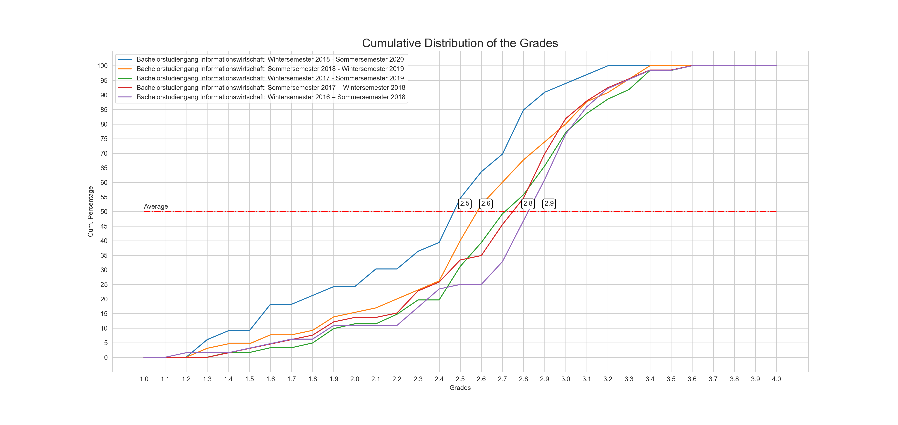

# About this project
Go to the "KIT Einstufungstabelle" web page (click [here](https://www.sle.kit.edu/nachstudium/ects-einstufungstabellen.php)) and select the document of your interest. 
Then run the notebook and simply copy all the pdf content via CTRL+A and CTRL+C into the prompt field. You can add as many documents you want.

`Python Version: 3.10`

### Known issues:
+ On Safari different elements get copied if you copy the whole document page, instead **use firefox**.

___
### Examples 

