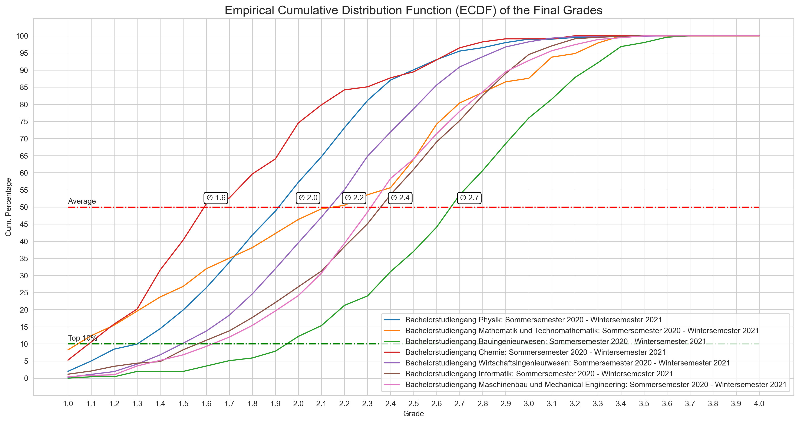

# How to install
Go within your shell / terminal to an empty folder and type in the following command:
```console
git clone https://github.com/negralessio/ecdf_grades
```
Create virtual environment, activate it and download dependencies with ...
```shell
conda create -n kit_ecdf_env python==3.9
conda activate kit_ecdf_env
conda install --file requirements.txt
```

Then run jupyter notebook inside the directory with the following command and run all cells
```shell
jupyter-notebook
````

Go to the "KIT Einstufungstabelle" web page (click [here](https://www.sle.kit.edu/nachstudium/ects-einstufungstabellen.php)) 
and select the document of your interest. 
Then run the notebook and simply copy all the pdf content via CTRL+A and CTRL+C into the prompt field. 
You can add as many documents you want -- if you want to continue just press enter on the prompt field (i.e. enter nothing).


___
### Examples 

